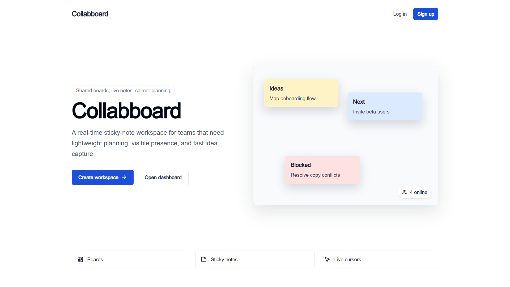
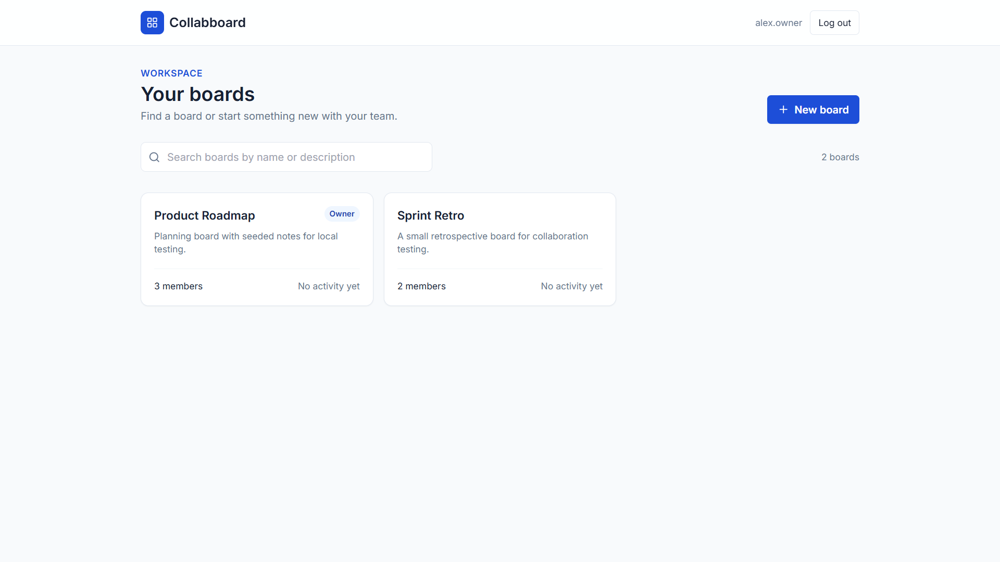
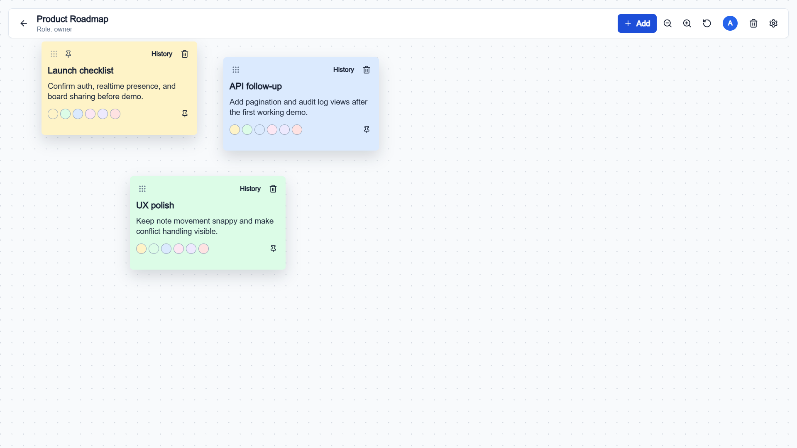
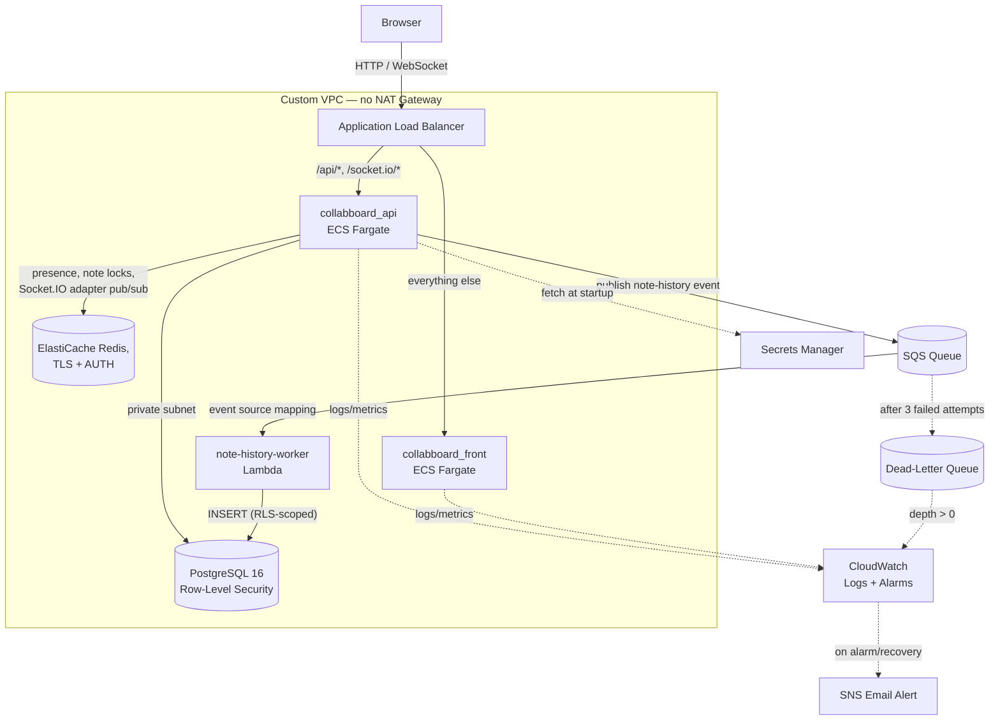

# Collabboard Project

A real-time collaborative whiteboard application that allows multiple users to create, edit, and share notes in real-time — deployed on AWS with a production-style architecture: containerized services on ECS/Fargate, a private RLS-enforced Postgres database, a Redis-backed real-time layer, an async event-driven audit pipeline, infrastructure managed entirely as code with Terraform, zero-secret CI/CD, and live CloudWatch alerting.

## Live Demo

**[collabboard-production-alb-1430556753.ap-southeast-2.elb.amazonaws.com](http://collabboard-production-alb-1430556753.ap-southeast-2.elb.amazonaws.com)**

Register a free account to try it out. Running on the raw ALB endpoint for now — a custom domain with HTTPS (ACM + Route 53) is a planned next step, see [Notes](#notes). Some browsers with strict "upgrade HTTP to HTTPS" settings (e.g. Brave Shields) may need that setting disabled for this specific URL until the custom domain lands, since there's no TLS listener yet.

## Overview

Collaboard is a web-based collaborative canvas where users can:
- Create and manage boards
- Add sticky notes and sketch content
- Collaborate with other users in real-time
- See live presence, cursors, and typing indicators from team members
- Lock a note while editing it, so two people can't overwrite each other mid-edit
- Undo/redo and track note history
- Organize and manage board members

## Screenshots







## Architecture

Both services run independently on AWS ECS/Fargate behind a single Application Load Balancer, which routes traffic by path. The frontend and API share one public entry point, but scale, deploy, and fail independently of each other. The API is designed to run as multiple ECS tasks: all realtime state (presence, note locks) lives in Redis rather than in-process memory, and a Redis-backed Socket.IO adapter keeps room broadcasts correct across instances.

Note-history writes are handled entirely outside the request path: the API publishes an event to SQS and returns immediately, and a separate Lambda function consumes the queue and persists the record — a save can never be slowed down or failed by an audit-log write.



**Key design points:**
- **Infrastructure as code** — the entire stack (VPC, RDS, ElastiCache, ECS, ALB, IAM, Secrets Manager, SQS/Lambda, CloudWatch/SNS) is defined in Terraform under `infra/main/`, with a small one-time bootstrap project (`infra/bootstrap/`) that creates the S3 bucket used for Terraform's own remote state. Nothing in production was created by hand.
- **Path-based routing** — `/api/*` and `/socket.io/*` go to the backend; everything else goes to the frontend. Both apps share one origin, so there's no CORS to manage between them.
- **Private by default, no NAT Gateway** — the API, database, Redis, and the note-history Lambda all run in private subnets with no public IP or internet route. Everything they need (ECR image pulls, CloudWatch Logs, Secrets Manager, SQS) goes through VPC interface endpoints instead, which is both more secure and considerably cheaper than a NAT Gateway for a low-traffic service.
- **Database-enforced multi-tenancy** — PostgreSQL Row-Level Security restricts every query to the rows a user is actually authorized to see, enforced by the database itself via a dedicated non-superuser application role, not just application code — enforced consistently whether the write comes from the API's request path or the async Lambda worker.
- **Stateless-by-design realtime layer** — presence and note locks live in Redis, not in a Postgres table or in-process memory, so any ECS task can serve any client and horizontal scaling is safe. A `@socket.io/redis-adapter`-backed pub/sub layer keeps room broadcasts (cursor moves, lock events, note updates) correct when multiple API tasks are running — verified locally with `docker compose up --scale api=2` behind an nginx reverse proxy with dynamic upstream re-resolution.
- **Decoupled async writes, not just a second cache** — note-history is intentionally built on SQS rather than Redis/BullMQ, even though Redis is already in the stack: it's a genuinely distinct AWS-native queueing primitive (durable, retry-with-backoff, dead-letter queue built in) rather than overloading the same technology that already handles presence and locking.
- **No long-lived secrets** — database credentials, the Redis AUTH token, and the JWT signing key are Terraform-generated, stored in Secrets Manager, and injected into ECS tasks natively (not as build-time or manually-set environment variables). GitHub Actions authenticates to AWS via OIDC, with no stored AWS keys at all.

## Tech Stack

### Frontend (`collabboard_front/`)

- **Next.js 14** — React framework with SSR and static optimization
- **TypeScript** — Type-safe JavaScript
- **Tailwind CSS** — Utility-first styling
- **Zustand** — Lightweight state management
- **Socket.IO Client** — Real-time bidirectional communication with WebSocket fallback
- **React Hook Form + Zod** — Form handling and validation
- **Axios** — HTTP client for API requests
- **Framer Motion** — Smooth animations and transitions
- **React Query** — Server state management

### Backend (`collabboard_api/`)

- **NestJS** — Progressive Node.js framework with dependency injection
- **TypeScript** — Type-safe backend code
- **PostgreSQL 16** — Relational database with Row-Level Security (RLS)
- **Redis** — Presence tracking, note-locking (atomic Lua-scripted acquire/renew/release), and the Socket.IO cross-instance adapter, connected over TLS with AUTH
- **Socket.IO** — Real-time event-driven communication via WebSocket, backed by `@socket.io/redis-adapter` for multi-instance correctness
- **Amazon SQS** — async note-history event queue, decoupled entirely from the request path
- **JWT Authentication** — Secure token-based auth with Google OAuth support
- **Passport.js** — Authentication middleware
- **TypeORM** — ORM for database operations

### Async Worker (`collabboard_api/lambda/note-history-worker/`)

- **AWS Lambda** (Node.js 20.x) — standalone SQS-triggered function, independent of the main NestJS app's dependency tree
- Connects to RDS as the same least-privilege `collabboard_app` role the API uses, fetching credentials from the same Secrets Manager secret
- Reports partial-batch failures (`ReportBatchItemFailures`) so one malformed message can't block or fail an entire batch of otherwise-good ones
- Runs inside the VPC, in the same private subnets as the API and RDS

### Infrastructure & Deployment

- **Terraform** — the entire AWS stack below is defined as code in `infra/main/`, with remote state in S3 (native S3 locking, no DynamoDB table needed)
- **AWS ECS/Fargate** — runs both services as containers with no servers to patch or manage
- **Application Load Balancer** — single public entry point, path-based routing between services, 120s idle timeout to comfortably exceed Socket.IO's default ping interval
- **Amazon RDS (PostgreSQL 16)** — managed database in a private subnet, with Row-Level Security enforced through a dedicated `collabboard_app` role (`NOBYPASSRLS`) separate from the RDS master user
- **Amazon ElastiCache (Redis)** — single-node replication group, TLS in-transit encryption + AUTH token, in the same private subnets as RDS
- **Amazon SQS** — main queue plus a dead-letter queue (`maxReceiveCount = 3`), decoupling audit-log writes from the request path
- **AWS Lambda** — VPC-attached, SQS-triggered consumer for the note-history queue
- **Custom VPC** — public/private subnets across two AZs, security groups scoped per-service (SG-to-SG references, not CIDR blocks), VPC interface/gateway endpoints (ECR API, ECR DKR, CloudWatch Logs, Secrets Manager, SQS, S3) so private subnets never need a NAT Gateway
- **AWS Secrets Manager** — database credentials (both the RDS master user and the application-only `collabboard_app` role), the Redis AUTH token (stored as a complete `rediss://` connection URL), and the JWT secret — all Terraform-generated, fetched by ECS and Lambda at startup via native/SDK secret access
- **Amazon ECR** — private container registry for both service images, with a lifecycle policy keeping only the 10 most recent images and expiring untagged images after 1 day
- **GitHub Actions + OIDC** — test-gated CI/CD with no stored AWS credentials; on every push to `master`, each service is independently built, tagged with its commit SHA, pushed, and deployed
- **Amazon CloudWatch** — centralized logs, Container Insights metrics, and 9 alarms (CPU/memory/unhealthy-hosts/zero-healthy-hosts for both services, plus dead-letter-queue depth) wired to email alerts via SNS
- **Docker & Docker Compose** — local development environment, including a scalable `api` service (behind an nginx reverse proxy with dynamic DNS re-resolution) for testing multi-instance behavior locally before it ever touches AWS

## Real-time Features

**WebSocket Communication:**
- Uses **Socket.IO**, backed by `@socket.io/redis-adapter`, for real-time collaboration that stays correct across multiple backend instances
- Enables live presence detection (who's online), cursor tracking, and typing indicators
- Instant note creation, updates, and deletions across all connected clients
- Conflict resolution for concurrent edits (optimistic version locking, with an auto-merge path for non-overlapping field changes)

**Presence System:**
- Tracks active board members in Redis (`board:{boardId}:presence`), not a database table — keeps the hottest, highest-frequency writes (heartbeat, cursor position) off Postgres entirely
- Shows online/offline status and live cursor positions
- Automatically evicted on disconnect, and immediately on board-membership revocation (a removed member is kicked from the room and their presence cleared in real time via `pg_notify`, not just on their next heartbeat)

**Note Locking:**
- Redis-backed per-note locks (`note:{noteId}:lock`, 8s TTL, atomically acquired/renewed/released via Lua scripts to avoid race conditions)
- A note being edited shows a live lock badge to everyone else on the board; other users can't drag or edit it until it's released
- Locks are renewed automatically while typing, released on save/cancel/disconnect (scoped to exactly the sockets/notes that disconnecting client held, not a blanket per-user release that could yank a lock still in use by another of that user's open tabs), and released board-scoped if the holder is removed from the board mid-edit
- Late-joining clients see a snapshot of currently-locked notes immediately (via a single Redis `MGET` scoped to that board's notes), not just after attempting to edit one

**Async Note History:**
- Every note mutation (`create`, `update`, `position`, `delete`, `restore`) publishes an event to SQS after its database write succeeds — a slow or failed publish is caught and logged internally, never propagated back to the caller, since a missed audit-log entry must never fail or delay the actual save
- A separate Lambda function consumes the queue and persists each event into `note_history`, connecting as the same RLS-scoped `collabboard_app` role and setting the same session-level authorization context (`app.current_user_id`) the main API uses, so history writes are subject to the identical row-level security policy as everything else
- Malformed or failing messages retry up to 3 times, then land in a dead-letter queue — monitored by its own CloudWatch alarm rather than failing silently

## Project Structure

- `collabboard_api/` — NestJS backend service
  - `lambda/note-history-worker/` — standalone SQS-triggered Lambda consumer
  - `scripts/run-migrations.js` — production migration runner
- `collabboard_front/` — Next.js frontend service
- `infra/bootstrap/` — one-time Terraform config that creates the S3 bucket for remote state; applied once, essentially never touched again
- `infra/main/` — the real infrastructure: networking, data layer, ECR/IAM, secrets, load balancer, ECS, SQS/Lambda, monitoring
- `docker-compose.yml` — root Compose file for local development (`postgres`, `redis`, `api`, `front`, `nginx`)
- `.github/workflows/ci.yml` — test suite, independent `deploy-api`/`deploy-front` jobs on every push to `master`, and a manually-triggered `deploy-migrations` job

## Getting Started

### Prerequisites

- Docker & Docker Compose
- Node.js 20+ (for local development without Docker)
- Terraform 1.6+ and the AWS CLI (only needed if working on infrastructure, not for local app development)

### Using Docker Compose

```bash
docker compose up --build
```

The Compose file builds and starts:

- **postgres** — PostgreSQL database service on port 5432
- **redis** — Redis for presence, note locks, and Socket.IO's cross-instance adapter
- **api** — NestJS backend service (behind nginx; not exposed on a fixed host port so it can be scaled)
- **front** — Next.js frontend service on port 3000
- **nginx** — reverse proxy on port 80, dynamically re-resolving the `api` service via Docker's embedded DNS so it can be scaled to multiple replicas without a stale-DNS restart

Once running, access the app at `http://localhost` (or `http://localhost:3000` to bypass nginx). There's no local SQS/Lambda equivalent — the note-history queue publisher no-ops locally when `NOTE_HISTORY_QUEUE_URL` is unset (logging a one-time warning), so the app runs normally without it.

To test the multi-instance realtime layer locally:

```bash
docker compose up --build --scale api=2
```

### Environment Configuration

**Frontend** (`collabboard_front/.env.local`):
- `NEXT_PUBLIC_API_URL` — API endpoint (e.g., `http://localhost:3050/api`)
- `NEXT_PUBLIC_SOCKET_URL` — WebSocket server URL (e.g., `http://localhost:3050`)

In production, both are set as Docker build arguments (`NEXT_PUBLIC_*` variables compile into the client bundle, so they can't be supplied as runtime environment variables) and point at relative, same-origin paths — the frontend and API share one ALB, so no absolute URL or CORS configuration is needed.

**Backend** — configured via `docker-compose.yml` locally, and via ECS task definition environment variables + AWS Secrets Manager in production:
- Database credentials and connection (`DB_SSL=true` against RDS, connecting as the dedicated `collabboard_app` role — never the RDS master user)
- `REDIS_URL` — full `rediss://` connection string including the AUTH token, injected as a single secret
- `NOTE_HISTORY_QUEUE_URL` — the SQS queue URL; unset locally (no-op), the real queue URL in production
- `APP_PASSWORD` — read by `002_enable_rls.sql` via `\getenv`, used only during migrations to set the application role's password; sourced from Secrets Manager in production, a fixed local value in Docker Compose and CI
- JWT secret and expiry
- Google OAuth settings (optional)
- CORS origin

**Lambda** (`note-history-worker`):
- `DB_CREDENTIALS_SECRET_ARN` — same Secrets Manager secret the API uses, fetched via the AWS SDK at invocation time

## Database

PostgreSQL 16 with:
- **Row-Level Security (RLS)** for multi-tenant isolation, enforced through a dedicated non-owner application role (`collabboard_app`, `NOBYPASSRLS`) — kept entirely separate from the RDS master user, which only migrations ever connect as
- `SECURITY DEFINER` helper functions for policy checks that would otherwise self-reference (board membership lookups) or run pre-authentication (the login user lookup)
- Real-time notifications via `pg_notify` for board/note/membership changes, consumed by every API instance independently — this is what lets membership revocation (e.g. being removed from a board) take effect live, kicking the affected socket immediately rather than waiting for their next action
- Migrations in `collabboard_api/migrations/`, run via `collabboard_api/scripts/run-migrations.js` (a Node script using the `pg` package for plain SQL, shelling out to the real `psql` binary only for the one file that needs its meta-commands, and tracking applied migrations in a `schema_migrations` table so re-running the script against an already-migrated database is always a safe no-op):
  - `001` — initial schema and seed data
  - `002` — creates the `collabboard_app` role and its RLS policies/`SECURITY DEFINER` helpers. Uses a psql `\if`/`\else` branch to either `CREATE ROLE` or `ALTER ROLE` depending on whether the role already exists, rather than dropping and recreating it — PostgreSQL 16 tightened `CREATEROLE` semantics (altering a role you didn't create *in the same session* requires an explicit `ADMIN OPTION` grant) and separately restricts `ALTER ROLE ... SUPERUSER/BYPASSRLS` to true superusers even when the value isn't changing, which the RDS master user isn't; the `ALTER` branch omits those two attributes entirely rather than fighting either restriction, since nothing in this system can grant them after creation anyway.
  - `003` — `pg_notify` trigger on `board_members`, enabling live membership-revocation handling
  - `004` — retires the Postgres-backed presence table (`active_board_users`) now that presence lives in Redis

Presence and note locks are intentionally **not** in Postgres — they're high-frequency, ephemeral, and don't need durability, so they live in Redis instead, keeping that write volume off the relational database entirely. Note-history writes are in Postgres for durability, but arrive asynchronously through SQS/Lambda rather than inline with the request.

**Running migrations against production** is a deliberate, manual action — either via GitHub Actions' `deploy-migrations` job (triggered manually via `workflow_dispatch`, never automatically on push) or a one-off `aws ecs run-task` invocation using the same image. This is intentional: this is a solo-maintained repository with no PR review gate on `master`, so automatically running arbitrary SQL against production on every push is a real risk this project deliberately avoids. Application deploys and schema migrations are two separate actions.

## Deployment & CI/CD

Every push to `master` runs the relevant test suite first; only on a pass does the corresponding deploy job run — backend and frontend deploy independently of each other via GitHub Actions, authenticating to AWS via OIDC (no stored credentials).

Each deploy:
1. Authenticates to AWS via OIDC (GitHub exchanges a short-lived signed token for temporary AWS credentials scoped to this repo and branch)
2. Builds a Docker image, tagged with the commit SHA (not `:latest`) for traceability and easy rollback
3. Pushes to Amazon ECR
4. Registers a new ECS task definition revision with the new image
5. Deploys to ECS, waiting for the service to report healthy before the workflow succeeds

If a deploy fails — a bad health check, a startup crash — the workflow fails loudly and prints the relevant ECS events and CloudWatch logs directly in the Actions run, rather than leaving a broken version silently running.

Database migrations run separately via a manually-triggered `deploy-migrations` job — see [Database](#database) above for why this is intentionally not automatic.

The `note-history-worker` Lambda deploys through the same push-to-`master` discipline as the two ECS services: `deploy-lambda` installs dependencies, zips the package, and calls `aws lambda update-function-code` directly, then blocks on `aws lambda wait function-updated` so the job only reports success once the deployment has actually finished. Terraform still owns the function's configuration (VPC config, IAM role, memory/timeout, environment variables) via `infra/main/lambda.tf`, but a `lifecycle { ignore_changes = [filename, source_code_hash] }` block stops it from also trying to reconcile which code package is currently deployed — same reasoning as the `ignore_changes` already in place on the ECS services, just applied to a different resource. Terraform and CI each own one half of the same resource without stepping on each other.

## Observability

- Application logs ship to CloudWatch Logs automatically (14-day retention)
- Container Insights provides per-task CPU/memory metrics
- 9 CloudWatch Alarms — CPU, memory, unhealthy-host-count, and zero-healthy-host-count for both the API and frontend services, plus note-history dead-letter-queue depth — notify via SNS email on both alarm and recovery. The "zero healthy hosts" alarms explicitly treat *missing* metric data as a breach, since a fully-down service stops emitting datapoints rather than reporting a `0`; the DLQ alarm deliberately does the opposite (`treat_missing_data = "missing"`), since an empty queue with no datapoints is its normal, healthy state
- ECS Service Auto Scaling adjusts task count based on load (CPU for the frontend, ALB request count per target for the API, since the API is I/O-bound on Postgres/Redis rather than CPU-bound)

## Key Features

- ✅ Real-time collaborative editing, correct across multiple backend instances
- ✅ WebSocket-powered live updates, presence, cursors, and typing indicators
- ✅ Redis-backed note locking to prevent concurrent-edit collisions
- ✅ Async, queue-backed note-history audit trail, fully decoupled from the request path
- ✅ User authentication with JWT + Google OAuth
- ✅ Board and member management, with live-revocation handling
- ✅ Note history and conflict detection
- ✅ Responsive design with Tailwind CSS
- ✅ Type-safe full-stack with TypeScript
- ✅ Entire AWS infrastructure defined and applied via Terraform
- ✅ Production deployment on AWS ECS/Fargate with automated, OIDC-authenticated CI/CD
- ✅ Full observability: structured logs, metrics, and alarms wired to real alerts

## Development

For local development without Docker:

**Backend:**
```bash
cd collabboard_api
npm install
npm run dev
```

**Frontend:**
```bash
cd collabboard_front
npm install
npm run dev
```

## Infrastructure Development

The `infra/main/` Terraform project is organized by concern rather than one monolithic file:

- `network.tf` — VPC, subnets, route tables, VPC endpoints, security groups
- `data.tf` — RDS Postgres, ElastiCache Redis, and their generated credentials
- `ecr.tf` / `iam.tf` — container registries and every IAM role/policy (GitHub OIDC deploy role, ECS execution/task roles, Lambda execution role)
- `secrets.tf` — Secrets Manager entries assembled from the generated credentials above
- `alb.tf` — load balancer, target groups, path-based listener rules
- `ecs.tf` — cluster, task definitions, services, autoscaling
- `queue.tf` — SQS queue and dead-letter queue
- `lambda.tf` — the note-history-worker Lambda function, its event source mapping, and its CloudWatch log group
- `monitoring.tf` — CloudWatch alarms and SNS

```bash
cd infra/main
terraform init
terraform plan
terraform apply
```

`infra/bootstrap/` only needs to be applied once, ever, to create the S3 backend `infra/main/` uses for remote state — see `infra/README.md` for the one-time setup sequence.

Note: Terraform provisions the Lambda function itself (via a first `data "archive_file"`-built package, just to give the resource something valid to create), but a `lifecycle { ignore_changes = [filename, source_code_hash] }` block means it never touches the function's *code* again after that first `apply` — every real code update goes through the `deploy-lambda` CI job instead, the same way `deploy-api`/`deploy-front` own the ECS services' running images.

## Troubleshooting

If Docker Compose cannot pull `postgres:16-alpine` or `redis:7-alpine`:
- Confirm Docker daemon is running
- Check internet connectivity to Docker Hub
- Verify no proxy or firewall blocks image pulls

If you edit backend source and don't see the change take effect: the `api` service builds a static image from `Dockerfile` with no source volume mount, so `docker compose restart api` alone will **not** pick up new code — rebuild it with `docker compose up --build api`.

If a fresh ECS deployment can't log in and CloudWatch shows `function find_user_for_auth(unknown) does not exist` or similar: migrations have never been run against that RDS instance. RDS provisioning and application deployment are separate from schema migration — see [Database](#database) above.

If note-history events are visibly failing to publish (`ETIMEDOUT` in the API logs when calling SQS) even though the queue and Lambda are provisioned: confirm a VPC interface endpoint exists for SQS in `network.tf`. The API and Lambda run in private subnets with no NAT Gateway, so every AWS service they call needs an explicit VPC endpoint — SQS is easy to miss when adding a new AWS dependency, since the failure is a plain network timeout rather than an obvious permissions error. If the endpoint already exists but a long-running task still fails, it may have cached an earlier DNS resolution from before the endpoint existed — a fresh deployment (`aws ecs update-service --force-new-deployment`) resolves this.

## Notes

Planned next steps:
- A custom domain with HTTPS (ACM + Route 53) — the live demo currently runs on plain HTTP via the raw ALB DNS name
- Known limitation: nginx (locally) and the ALB (in production) both support scaling to multiple backend instances, but neither implements session affinity for Socket.IO. A client whose network blocks the WebSocket upgrade and falls back to Socket.IO's HTTP long-polling transport could have consecutive polls land on different replicas and need to reconnect. Clients that complete the WS upgrade (the default path in modern browsers) are unaffected, since a single established WebSocket connection stays with whichever instance accepted it for its whole duration.

# Github CI
[](https://github.com/RuckerHans/Collabboard/actions/workflows/ci.yml)