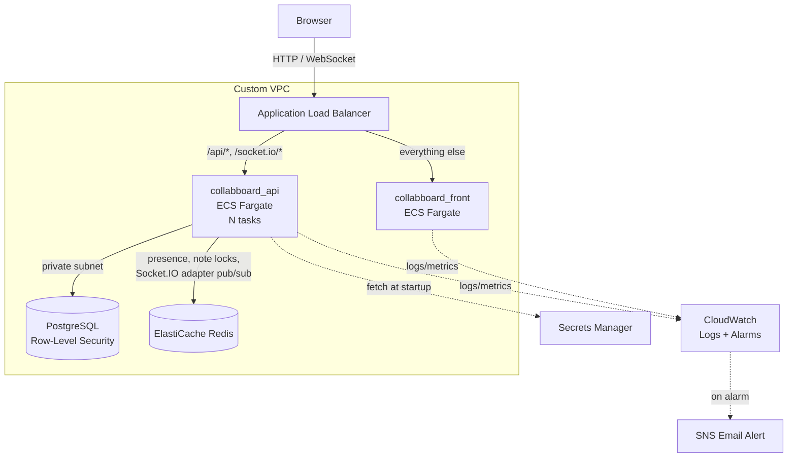

# Collaboard Project

A real-time collaborative whiteboard application that allows multiple users to create, edit, and share notes and sketches in real-time — deployed on AWS with a production-style architecture: containerized services on ECS/Fargate, a private RLS-enforced Postgres database, a Redis-backed real-time layer, zero-secret CI/CD, and live CloudWatch alerting.

## Live Demo

**[collabboard-alb-480961856.ap-southeast-2.elb.amazonaws.com](http://collabboard-alb-480961856.ap-southeast-2.elb.amazonaws.com)**

Register a free account to try it out. **Note:** AWS deploys are temporarily paused while the Redis/real-time upgrade below is being finished locally (see [CI/CD](#deployment--cicd)) — the live demo currently reflects the pre-Redis architecture. It will be redeployed via Terraform once that stage lands. Running on the raw ALB endpoint for now — a custom domain with HTTPS (ACM + Route 53) is a planned next step, see [Notes](#notes).

## Overview

Collaboard is a web-based collaborative canvas where users can:
- Create and manage boards
- Add sticky notes and sketch content
- Collaborate with other users in real-time
- See live presence, cursors, and typing indicators from team members
- Lock a note while editing it, so two people can't overwrite each other mid-edit
- Undo/redo and track note history
- Organize and manage board members

## Screenshots


## Architecture

Both services run independently on AWS ECS/Fargate behind a single Application Load Balancer, which routes traffic by path. The frontend and API share one public entry point, but scale, deploy, and fail independently of each other. The API itself is designed to run as multiple ECS tasks: all realtime state (presence, note locks) lives in Redis rather than in-process memory, and a Redis-backed Socket.IO adapter keeps room broadcasts correct across instances.



**Key design points:**
- **Path-based routing** — `/api/*` and `/socket.io/*` go to the backend; everything else goes to the frontend. Both apps share one origin, so there's no CORS to manage between them.
- **Private by default** — the API, database, and Redis run in private subnets with no public IP. Only the load balancer is internet-facing.
- **Database-enforced multi-tenancy** — PostgreSQL Row-Level Security restricts every query to the rows a user is actually authorized to see, enforced by the database itself, not just application code.
- **Stateless-by-design realtime layer** — presence and note locks live in Redis, not in a Postgres table or in-process memory, so any ECS task can serve any client and horizontal scaling is safe. A `@socket.io/redis-adapter`-backed pub/sub layer keeps room broadcasts (cursor moves, lock events, note updates) correct when multiple API tasks are running.
- **No long-lived secrets** — database credentials and the JWT signing key are pulled from AWS Secrets Manager at container startup; GitHub Actions authenticates to AWS via OIDC, with no stored AWS keys at all.

## Tech Stack

### Frontend (`collabboard_front/`)

- **Next.js 14** — React framework with SSR and static optimization
- **TypeScript** — Type-safe JavaScript
- **Tailwind CSS** — Utility-first styling
- **Zustand** — Lightweight state management
- **Socket.IO Client** — Real-time bidirectional communication with WebSocket fallback
- **React Hook Form + Zod** — Form handling and validation
- **Axios** — HTTP client for API requests
- **Framer Motion** — Smooth animations and transitions
- **React Query** — Server state management

### Backend (`collabboard_api/`)

- **NestJS** — Progressive Node.js framework with dependency injection
- **TypeScript** — Type-safe backend code
- **PostgreSQL** — Relational database with Row-Level Security (RLS)
- **Redis** — Presence tracking, note-locking (atomic Lua-scripted acquire/renew/release), and the Socket.IO cross-instance adapter
- **Socket.IO** — Real-time event-driven communication via WebSocket, backed by `@socket.io/redis-adapter` for multi-instance correctness
- **JWT Authentication** — Secure token-based auth with Google OAuth support
- **Passport.js** — Authentication middleware
- **TypeORM** — ORM for database operations

### Infrastructure & Deployment

- **AWS ECS/Fargate** — runs both services as containers with no servers to patch or manage
- **Application Load Balancer** — single public entry point, path-based routing between services
- **Amazon RDS (PostgreSQL)** — managed database in a private subnet, with Row-Level Security
- **Amazon ElastiCache (Redis)** — *(local dev only via `redis:7-alpine`; ElastiCache provisioning is a planned Terraform stage, see [Notes](#notes))*
- **Custom VPC** — public/private subnets, security groups scoped per-service, VPC interface endpoints (ECR, CloudWatch Logs, Secrets Manager) so private subnets never need a NAT Gateway
- **AWS Secrets Manager** — database credentials and JWT secret, fetched at container startup
- **Amazon ECR** — private container registry for both service images
- **GitHub Actions + OIDC** — test-gated CI/CD with no stored AWS credentials; deploy jobs are currently paused while this stage is in progress (see [CI/CD](#deployment--cicd))
- **Amazon CloudWatch** — centralized logs, Container Insights metrics, and alarms (CPU, memory, host health) wired to email alerts via SNS
- **Docker & Docker Compose** — local development environment, including a scalable `api` service for testing multi-instance behavior locally

## Real-time Features

**WebSocket Communication:**
- Uses **Socket.IO**, backed by `@socket.io/redis-adapter`, for real-time collaboration that stays correct across multiple backend instances
- Enables live presence detection (who's online), cursor tracking, and typing indicators
- Instant note creation, updates, and deletions across all connected clients
- Conflict resolution for concurrent edits (optimistic version locking, with an auto-merge path for non-overlapping field changes)

**Presence System:**
- Tracks active board members in Redis (`board:{boardId}:presence`), not a database table — keeps the hottest, highest-frequency writes (heartbeat, cursor position) off Postgres entirely
- Shows online/offline status and live cursor positions
- Automatically evicted on disconnect, and immediately on board-membership revocation (a removed member is kicked from the room and their presence cleared in real time, not just on their next heartbeat)

**Note Locking:**
- Redis-backed per-note locks (`note:{noteId}:lock`, 8s TTL, atomically acquired/renewed/released via Lua scripts to avoid race conditions)
- A note being edited shows a live lock badge to everyone else on the board; other users can't drag or edit it until it's released
- Locks are renewed automatically while typing, released on save/cancel/disconnect, and released board-scoped if the holder is removed from the board mid-edit
- Late-joining clients see a snapshot of currently-locked notes immediately (via a single Redis `MGET` scoped to that board's notes), not just after attempting to edit one

## Project Structure

This repository contains a collaborative whiteboard application with separate API and frontend services:

- `collabboard_api/` — NestJS backend service
- `collabboard_front/` — Next.js frontend service
- `docker-compose.yml` — root Compose file for local development (`postgres`, `redis`, `api`, `front`, `nginx`)
- `.github/workflows/ci.yml` — test suite plus independent `deploy-api` / `deploy-front` jobs (currently disabled) that build, push, and roll out to ECS on every push to `master`

## Getting Started

### Prerequisites

- Docker & Docker Compose
- Node.js 20+ (for local development without Docker)

### Using Docker Compose

Use the root `docker-compose.yml` to launch the full stack from the repository root:

```bash
docker compose up --build
```

The Compose file builds and starts:

- **postgres** — PostgreSQL database service on port 5432
- **redis** — Redis for presence, note locks, and Socket.IO's cross-instance adapter
- **api** — NestJS backend service (behind nginx; not exposed on a fixed host port so it can be scaled)
- **front** — Next.js frontend service on port 3000
- **nginx** — reverse proxy on port 80, dynamically re-resolving the `api` service so it can be scaled to multiple replicas without a stale-DNS restart

Once running, access the app at `http://localhost` (or `http://localhost:3000` to bypass nginx).

To test the multi-instance realtime layer locally:

```bash
docker compose up --build --scale api=2
```

### Environment Configuration

**Frontend** (`collabboard_front/.env.local`):
- `NEXT_PUBLIC_API_URL` — API endpoint (e.g., `http://localhost:3050/api`)
- `NEXT_PUBLIC_SOCKET_URL` — WebSocket server URL (e.g., `http://localhost:3050`)

In production, both are set as Docker build arguments (`NEXT_PUBLIC_*` variables compile into the client bundle, so they can't be supplied as runtime environment variables) and point at relative, same-origin paths — the frontend and API share one ALB, so no absolute URL or CORS configuration is needed.

**Backend** — configured via `docker-compose.yml` locally, and via ECS task definition environment variables + AWS Secrets Manager in production:
- Database credentials and connection (`DB_SSL=true` against RDS)
- `REDIS_URL` — Redis connection string
- JWT secret and expiry
- Google OAuth settings (optional)
- CORS origin

## Database

PostgreSQL with:
- **Row-Level Security (RLS)** for multi-tenant isolation, enforced through a dedicated non-owner application role with `NOBYPASSRLS`
- `SECURITY DEFINER` helper functions for policy checks that would otherwise self-reference (board membership lookups) or run pre-authentication (the login user lookup)
- Real-time notifications via `pg_notify` for board/note/membership changes, consumed by every API instance independently — this is what lets membership revocation (e.g. being removed from a board) take effect live, kicking the affected socket immediately rather than waiting for their next action
- Migrations in `collabboard_api/migrations/`:
  - `001` — initial schema and seed data
  - `002` — RLS policies and `SECURITY DEFINER` helpers
  - `003` — `pg_notify` trigger on `board_members`, enabling live membership-revocation handling
  - `004` — retires the Postgres-backed presence table (`active_board_users`) now that presence lives in Redis

Presence and note locks are intentionally **not** in Postgres — they're high-frequency, ephemeral, and don't need durability, so they live in Redis instead, keeping that write volume off the relational database entirely.

## Deployment & CI/CD

Every push to `master` runs the relevant test suite first; only on a pass would the corresponding deploy job run — backend and frontend deploy independently of each other.

> **Deploys are currently paused** (`deploy-api` / `deploy-front` are gated behind `if: ${{ false }}` in `ci.yml`) while the Redis/multi-instance work in this README is being built and verified locally. Tests and builds still run on every push; only the ECS rollout step is skipped. Re-enabling deploy is planned alongside the Terraform stage below.

When enabled, each deploy:
1. Authenticates to AWS via OIDC (no stored credentials — GitHub exchanges a short-lived signed token for temporary AWS credentials scoped to this repo and branch)
2. Builds a Docker image, tagged with the commit SHA (not `:latest`) for traceability and easy rollback
3. Pushes to Amazon ECR
4. Registers a new ECS task definition revision with the new image
5. Deploys to ECS, waiting for the service to report healthy before the workflow succeeds

If a deploy fails — a bad health check, a startup crash — the workflow fails loudly rather than leaving a broken version silently running.

## Observability

- Application logs ship to CloudWatch Logs automatically (14-day retention)
- Container Insights provides per-task CPU/memory metrics
- CloudWatch Alarms watch CPU, memory, and target health, notifying via SNS email — including a "zero healthy hosts" alarm that explicitly treats *missing* metric data as a breach, since a fully-down service stops emitting datapoints rather than reporting a `0`
- ECS Service Auto Scaling adjusts task count based on load (CPU for the frontend, ALB request count per target for the API, since the API is I/O-bound on Postgres/Redis rather than CPU-bound)

## Key Features

- ✅ Real-time collaborative editing, correct across multiple backend instances
- ✅ WebSocket-powered live updates, presence, cursors, and typing indicators
- ✅ Redis-backed note locking to prevent concurrent-edit collisions
- ✅ User authentication with JWT + Google OAuth
- ✅ Board and member management, with live-revocation handling
- ✅ Note history and conflict detection
- ✅ Responsive design with Tailwind CSS
- ✅ Type-safe full-stack with TypeScript
- ✅ Production deployment on AWS ECS/Fargate with automated CI/CD (currently mid-upgrade, see [CI/CD](#deployment--cicd))

## Development

For local development without Docker:

**Backend:**
```bash
cd collabboard_api
npm install
npm run dev
```

**Frontend:**
```bash
cd collabboard_front
npm install
npm run dev
```

## Troubleshooting

If Docker Compose cannot pull `postgres:16-alpine` or `redis:7-alpine`:
- Confirm Docker daemon is running
- Check internet connectivity to Docker Hub
- Verify no proxy or firewall blocks image pulls

If you edit backend source and don't see the change take effect: the `api` service builds a static image from `Dockerfile` with no source volume mount, so `docker compose restart api` alone will **not** pick up new code — rebuild it with `docker compose up --build api`.

## Notes

The full stack can be deployed locally using the root `docker-compose.yml` file. The production deployment runs on AWS (ECS/Fargate, RDS with SSL enforced, Secrets Manager for credentials) as described in [Architecture](#architecture) above.

Planned next steps:
- **Terraform** — codify the existing manually-built AWS stack (VPC, ECS, RDS, ALB) plus the new ElastiCache Redis instance as modules, so infrastructure changes are reviewable and repeatable rather than manual console/CLI steps
- **SQS-backed async worker** — offload note-history writes, board-activity audit logging, and eventually board export to a queue-consuming worker, separate from the request path
- A custom domain with HTTPS (ACM + Route 53)
- Known limitation: the nginx config dynamically re-resolves the `api` service via Docker DNS to support scaling, but does not implement session affinity — a client whose network blocks the WebSocket upgrade and falls back to Socket.IO's HTTP long-polling transport could have consecutive polls land on different replicas and need to reconnect. Clients that complete the WS upgrade (the default path in modern browsers) are unaffected.

# Github CI
[](https://github.com/RuckerHans/Collabboard/actions/workflows/ci.yml)