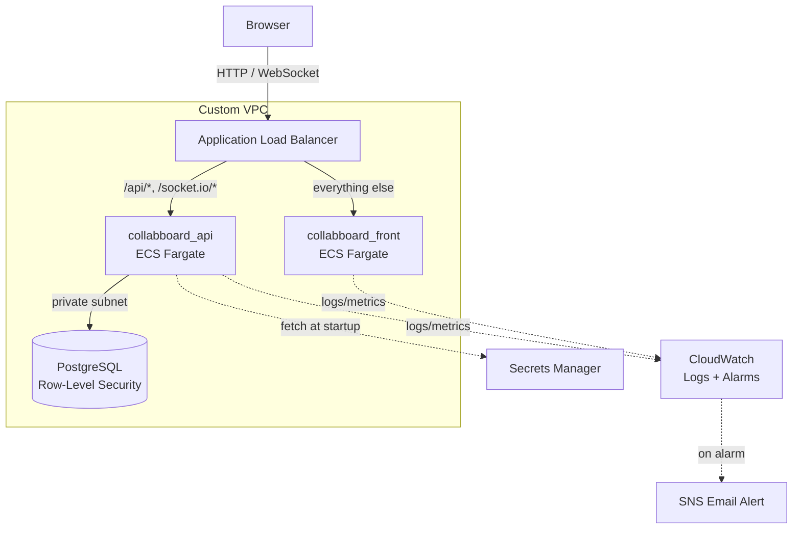

# Collaboard Project

A real-time collaborative whiteboard application that allows multiple users to create, edit, and share notes and sketches in real-time — deployed on AWS with a production-style architecture: containerized services on ECS/Fargate, a private RLS-enforced Postgres database, zero-secret CI/CD, and live CloudWatch alerting.

## Live Demo

**[collabboard-alb-480961856.ap-southeast-2.elb.amazonaws.com](http://collabboard-alb-480961856.ap-southeast-2.elb.amazonaws.com)**

Register a free account to try it out. Running on the raw ALB endpoint for now — a custom domain with HTTPS (ACM + Route 53) is a planned next step, see [Notes](#notes).

## Overview

Collaboard is a web-based collaborative canvas where users can:
- Create and manage boards
- Add sticky notes and sketch content
- Collaborate with other users in real-time
- See live presence and updates from team members
- Undo/redo and track note history
- Organize and manage board members

## Screenshots


## Architecture

Both services run independently on AWS ECS/Fargate behind a single Application Load Balancer, which routes traffic by path. The frontend and API share one public entry point, but scale, deploy, and fail independently of each other.



**Key design points:**
- **Path-based routing** — `/api/*` and `/socket.io/*` go to the backend; everything else goes to the frontend. Both apps share one origin, so there's no CORS to manage between them.
- **Private by default** — the API and database run in private subnets with no public IP. Only the load balancer is internet-facing.
- **Database-enforced multi-tenancy** — PostgreSQL Row-Level Security restricts every query to the rows a user is actually authorized to see, enforced by the database itself, not just application code.
- **No long-lived secrets** — database credentials and the JWT signing key are pulled from AWS Secrets Manager at container startup; GitHub Actions authenticates to AWS via OIDC, with no stored AWS keys at all.

## Tech Stack

### Frontend (`collabboard_front/`)

- **Next.js 14** — React framework with SSR and static optimization
- **TypeScript** — Type-safe JavaScript
- **Tailwind CSS** — Utility-first styling
- **Zustand** — Lightweight state management
- **Socket.IO Client** — Real-time bidirectional communication with WebSocket fallback
- **React Hook Form + Zod** — Form handling and validation
- **Axios** — HTTP client for API requests
- **Framer Motion** — Smooth animations and transitions
- **React Query** — Server state management

### Backend (`collabboard_api/`)

- **NestJS** — Progressive Node.js framework with dependency injection
- **TypeScript** — Type-safe backend code
- **PostgreSQL** — Relational database with Row-Level Security (RLS)
- **Socket.IO** — Real-time event-driven communication via WebSocket
- **JWT Authentication** — Secure token-based auth with Google OAuth support
- **Passport.js** — Authentication middleware
- **TypeORM** — ORM for database operations

### Infrastructure & Deployment

- **AWS ECS/Fargate** — runs both services as containers with no servers to patch or manage
- **Application Load Balancer** — single public entry point, path-based routing between services
- **Amazon RDS (PostgreSQL)** — managed database in a private subnet, with Row-Level Security
- **Custom VPC** — public/private subnets, security groups scoped per-service, VPC interface endpoints (ECR, CloudWatch Logs, Secrets Manager) so private subnets never need a NAT Gateway
- **AWS Secrets Manager** — database credentials and JWT secret, fetched at container startup
- **Amazon ECR** — private container registry for both service images
- **GitHub Actions + OIDC** — test-gated CI/CD with no stored AWS credentials; on every push to `master`, each service is independently built, tagged with its commit SHA, pushed, and deployed
- **Amazon CloudWatch** — centralized logs, Container Insights metrics, and alarms (CPU, memory, host health) wired to email alerts via SNS
- **Docker & Docker Compose** — local development environment

## Real-time Features

**WebSocket Communication:**
- Uses **Socket.IO** for real-time collaboration
- Enables live presence detection (who's online)
- Instant note creation, updates, and deletions across all connected clients
- Real-time cursor/activity tracking
- Conflict resolution for concurrent edits

**Presence System:**
- Tracks active board members
- Shows online/offline status
- Real-time activity updates

## Project Structure

This repository contains a collaborative whiteboard application with separate API and frontend services:

- `collabboard_api/` — NestJS backend service
- `collabboard_front/` — Next.js frontend service
- `docker-compose.yml` — root Compose file for local development (`postgres`, `api`, `front`)
- `.github/workflows/ci.yml` — test suite plus independent `deploy-api` / `deploy-front` jobs that build, push, and roll out to ECS on every push to `master`

## Getting Started

### Prerequisites

- Docker & Docker Compose
- Node.js 20+ (for local development without Docker)

### Using Docker Compose

Use the root `docker-compose.yml` to launch the full stack from the repository root:

```bash
cd "c:\Users\ASUS\Projects\Collaboard project"
docker compose up --build
```

The Compose file builds and starts:

- **postgres** — PostgreSQL database service on port 5432
- **api** — NestJS backend service on port 3050
- **front** — Next.js frontend service on port 3000

Once running, access the app at `http://localhost:3000`

### Environment Configuration

**Frontend** (`collabboard_front/.env.local`):
- `NEXT_PUBLIC_API_URL` — API endpoint (e.g., `http://localhost:3050/api`)
- `NEXT_PUBLIC_SOCKET_URL` — WebSocket server URL (e.g., `http://localhost:3050`)

In production, both are set as Docker build arguments (`NEXT_PUBLIC_*` variables compile into the client bundle, so they can't be supplied as runtime environment variables) and point at relative, same-origin paths — the frontend and API share one ALB, so no absolute URL or CORS configuration is needed.

**Backend** — configured via `docker-compose.yml` locally, and via ECS task definition environment variables + AWS Secrets Manager in production:
- Database credentials and connection (`DB_SSL=true` against RDS)
- JWT secret and expiry
- Google OAuth settings (optional)
- CORS origin

## Database

PostgreSQL with:
- **Row-Level Security (RLS)** for multi-tenant isolation, enforced through a dedicated non-owner application role with `NOBYPASSRLS`
- `SECURITY DEFINER` helper functions for policy checks that would otherwise self-reference (board membership lookups) or run pre-authentication (the login user lookup)
- Real-time notifications via `pg_notify` for cross-connection updates — this also makes the WebSocket layer safe to run as multiple ECS tasks, since every instance independently listens for the same Postgres notifications rather than holding state in memory
- Migrations in `collabboard_api/migrations/`

## Deployment & CI/CD

Every push to `master` runs the relevant test suite first; only on a pass does the corresponding deploy job run — backend and frontend deploy independently of each other.

1. Authenticate to AWS via OIDC (no stored credentials — GitHub exchanges a short-lived signed token for temporary AWS credentials scoped to this repo and branch)
2. Build a Docker image, tagged with the commit SHA (not `:latest`) for traceability and easy rollback
3. Push to Amazon ECR
4. Register a new ECS task definition revision with the new image
5. Deploy to ECS, waiting for the service to report healthy before the workflow succeeds

If a deploy fails — a bad health check, a startup crash — the workflow fails loudly rather than leaving a broken version silently running.

## Observability

- Application logs ship to CloudWatch Logs automatically (14-day retention)
- Container Insights provides per-task CPU/memory metrics
- CloudWatch Alarms watch CPU, memory, and target health, notifying via SNS email — including a "zero healthy hosts" alarm that explicitly treats *missing* metric data as a breach, since a fully-down service stops emitting datapoints rather than reporting a `0`
- ECS Service Auto Scaling adjusts task count based on load (CPU for the frontend, ALB request count per target for the API, since the API is I/O-bound on Postgres rather than CPU-bound)

## Key Features

- ✅ Real-time collaborative editing
- ✅ WebSocket-powered live updates
- ✅ User authentication with JWT + Google OAuth
- ✅ Board and member management
- ✅ Note history and conflict detection
- ✅ Responsive design with Tailwind CSS
- ✅ Type-safe full-stack with TypeScript
- ✅ Production deployment on AWS ECS/Fargate with automated CI/CD

## Development

For local development without Docker:

**Backend:**
```bash
cd collabboard_api
npm install
npm run dev
```

**Frontend:**
```bash
cd collabboard_front
npm install
npm run dev
```

## Troubleshooting

If Docker Compose cannot pull `postgres:16-alpine`:
- Confirm Docker daemon is running
- Check internet connectivity to Docker Hub
- Verify no proxy or firewall blocks image pulls

## Notes

The full stack can be deployed locally using the root `docker-compose.yml` file. The production deployment runs on AWS (ECS/Fargate, RDS with SSL enforced, Secrets Manager for credentials) as described in [Architecture](#architecture) above; a custom domain with HTTPS (ACM + Route 53) is a planned next step.

# Github CI
[](https://github.com/RuckerHans/Collabboard/actions/workflows/ci.yml)