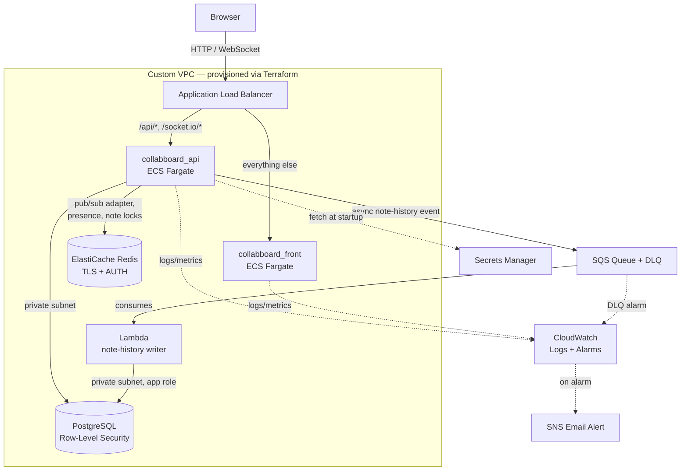

# Collaboard Project

A real-time collaborative whiteboard application that allows multiple users to create, edit, and share notes and sketches in real-time — deployed on AWS with a production-style architecture: containerized services on ECS/Fargate, a Redis-backed horizontally-scalable real-time layer, an event-driven async pipeline for note history (SQS + Lambda), a private RLS-enforced Postgres database, zero-secret CI/CD, and live CloudWatch alerting. The entire AWS infrastructure is provisioned and versioned with Terraform.

## Live Demo

**[collabboard-alb-480961856.ap-southeast-2.elb.amazonaws.com](http://collabboard-alb-480961856.ap-southeast-2.elb.amazonaws.com)**

Register a free account to try it out. Running on the raw ALB endpoint for now — a custom domain with HTTPS (ACM + Route 53) is a planned next step, see [Notes](#notes).

**Demo accounts** (seeded, shared — anyone can use them, so don't store anything private; the three roles show off the member-permission model):

| Role   | Email                      | Password      |
|--------|----------------------------|---------------|
| Owner  | `owner@collabboard.test`   | `Password123!` |
| Editor | `editor@collabboard.test`  | `Editor123!`   |
| Viewer | `viewer@collabboard.test`  | `Viewer123!`   |

Open the same board as two different accounts in two tabs to see live cursors, presence, and note locking in action.

## Overview

Collaboard is a web-based collaborative canvas where users can:
- Create and manage boards
- Add sticky notes and sketch content
- Collaborate with other users in real-time
- See live presence and updates from team members
- Undo/redo and track note history
- Organize and manage board members

## Screenshots


## Architecture

Both services run independently on AWS ECS/Fargate behind a single Application Load Balancer, which routes traffic by path. The frontend and API share one public entry point, but scale, deploy, and fail independently of each other. Redis backs the real-time layer so any number of API tasks can broadcast to the same board, and note-history writes are decoupled onto an async SQS → Lambda pipeline instead of happening inline on the request path.



**Key design points:**
- **Path-based routing** — `/api/*` and `/socket.io/*` go to the backend; everything else goes to the frontend. Both apps share one origin, so there's no CORS to manage between them.
- **Private by default** — the API, database, Redis, and Lambda all run in private subnets with no public IP. Only the load balancer is internet-facing.
- **Horizontally-scalable real-time layer** — Socket.IO runs behind a Redis pub/sub adapter, so any ECS task can broadcast an update to sockets connected on any other task. Board presence and per-note edit locks are also Redis-backed (atomic Lua scripts for locking), replacing an earlier Postgres-table approach that couldn't scale past a single task.
- **Decoupled note history** — note-history writes go through an SQS queue (with a dead-letter queue) consumed by a VPC-attached Lambda, instead of being written synchronously in the request path. The Lambda writes through the same restricted `collabboard_app` database role as the API, so Row-Level Security is enforced identically on both write paths.
- **Database-enforced multi-tenancy** — PostgreSQL Row-Level Security restricts every query to the rows a user is actually authorized to see, enforced by the database itself, not just application code.
- **No long-lived secrets** — database credentials, Redis AUTH token, and the JWT signing key are pulled from AWS Secrets Manager at container/function startup; GitHub Actions authenticates to AWS via OIDC, with no stored AWS keys at all.
- **Infrastructure as Code** — the full AWS stack (VPC, RDS, ElastiCache, ECR, IAM, Secrets Manager, ALB, ECS/Fargate, SQS/Lambda, CloudWatch/SNS) is provisioned and versioned with Terraform, built up in staged modules rather than one monolithic apply.

## Tech Stack

### Frontend (`collabboard_front/`)

- **Next.js 14** — React framework with SSR and static optimization
- **TypeScript** — Type-safe JavaScript
- **Tailwind CSS** — Utility-first styling
- **Zustand** — Lightweight state management
- **Socket.IO Client** — Real-time bidirectional communication with WebSocket fallback
- **React Hook Form + Zod** — Form handling and validation
- **Axios** — HTTP client for API requests
- **Framer Motion** — Smooth animations and transitions
- **React Query** — Server state management

### Backend (`collabboard_api/`)

- **NestJS** — Progressive Node.js framework with dependency injection
- **TypeScript** — Type-safe backend code
- **PostgreSQL** — Relational database with Row-Level Security (RLS)
- **Socket.IO + Redis adapter** — Real-time event-driven communication via WebSocket, broadcasting across ECS tasks through Redis pub/sub
- **Redis** — Board presence tracking and atomic per-note edit locking (Lua scripts), in addition to the Socket.IO adapter
- **Amazon SQS + AWS Lambda** — Async, decoupled note-history writes, with a dead-letter queue for failed events
- **JWT Authentication** — Secure token-based auth with Google OAuth support
- **Passport.js** — Authentication middleware
- **TypeORM** — ORM for database operations

### Infrastructure & Deployment

- **Terraform** — the entire AWS stack below is provisioned and versioned as code, built up in staged modules (networking → data layer → compute → CI/CD → async pipeline)
- **AWS ECS/Fargate** — runs both services as containers with no servers to patch or manage
- **Application Load Balancer** — single public entry point, path-based routing between services
- **Amazon RDS (PostgreSQL 16)** — managed database in a private subnet, with Row-Level Security
- **Amazon ElastiCache (Redis)** — TLS + AUTH-secured Redis for the Socket.IO adapter, presence, and note locking
- **Amazon SQS + AWS Lambda** — async note-history pipeline: API publishes an event to SQS, a VPC-attached Lambda consumes it and writes to Postgres through the same restricted app role as the API; a dead-letter queue plus CloudWatch alarm catches failed events
- **Custom VPC** — public/private subnets, security groups scoped per-service, VPC interface endpoints (ECR, CloudWatch Logs, Secrets Manager, SQS) so private subnets never need a NAT Gateway
- **AWS Secrets Manager** — database credentials, Redis AUTH token, and JWT secret, fetched at container/function startup
- **Amazon ECR** — private container registry for both service images
- **GitHub Actions + OIDC** — test-gated CI/CD with no stored AWS credentials; on every push to `master`, each service is independently built, tagged with its commit SHA, pushed, and deployed
- **Amazon CloudWatch** — centralized logs, Container Insights metrics, and alarms (CPU, memory, host health, SQS DLQ depth) wired to email alerts via SNS
- **Docker & Docker Compose** — local development environment
- **Kubernetes (kind) + Helm + ArgoCD** — a parallel, fully GitOps-managed deployment of the same stack: hand-built Helm chart, values-gated migration hook Jobs, automated sync/self-heal/prune, and a CI pipeline that ships SHA-tagged images to GHCR and commits tag bumps for ArgoCD to reconcile

## Real-time Features

**WebSocket Communication:**
- Uses **Socket.IO** for real-time collaboration, running behind a **Redis pub/sub adapter** so updates broadcast correctly no matter which ECS task a client is connected to
- Enables live presence detection (who's online)
- Instant note creation, updates, and deletions across all connected clients
- Real-time cursor/activity tracking
- Conflict resolution for concurrent edits, including atomic per-note edit locks implemented as Redis Lua scripts

**Presence System:**
- Tracks active board members in Redis (replacing an earlier Postgres-table approach that didn't scale across multiple tasks)
- Shows online/offline status
- Real-time activity updates

## Async Note History Pipeline

Note-history writes don't happen inline on the request path. Instead:

1. The API publishes a note-history event to an **SQS queue**
2. A **VPC-attached Lambda** consumes the event and writes it to Postgres, using the same restricted `collabboard_app` database role as the API — so Row-Level Security applies identically to both write paths
3. Failed events land in a **dead-letter queue**, with a CloudWatch alarm on DLQ depth so a stuck or failing consumer gets noticed instead of silently dropping history

This keeps note-history persistence off the hot path for board edits and gives the system a natural place to add more async work (exports, notifications, audit logging) later without touching the request/response cycle.

## Project Structure

This repository contains a collaborative whiteboard application with separate API and frontend services:

- `collabboard_api/` — NestJS backend service
- `collabboard_front/` — Next.js frontend service
- `docker-compose.yml` — root Compose file for local development (`postgres`, `api`, `front`)
- `deploy/k8s/` — kind cluster config for the local Kubernetes deployment (build history in its README)
- `deploy/chart/` — Helm chart for the full stack, including the values-gated migration hook Job
- `deploy/platform/` — ArgoCD install manifest (vendored/pinned) and the `Application` definition
- `.github/workflows/ci.yml` — test suite plus independent `deploy-api` / `deploy-front` jobs that build, push, and roll out to ECS on every push to `master`
- `.github/workflows/gitops.yml` / `tests.yml` — the Kubernetes image pipeline (GHCR + tag-bump commits for ArgoCD) and the shared test gate it calls

## Getting Started

### Prerequisites

- Docker & Docker Compose
- Node.js 20+ (for local development without Docker)

### Using Docker Compose

Use the root `docker-compose.yml` to launch the full stack from the repository root:

```bash
cd "c:\Users\ASUS\Projects\Collaboard project"
docker compose up --build
```

The Compose file builds and starts:

- **postgres** — PostgreSQL database service on port 5432
- **api** — NestJS backend service on port 3050
- **front** — Next.js frontend service on port 3000

Once running, access the app at `http://localhost:3000`

### Environment Configuration

**Frontend** (`collabboard_front/.env.local`):
- `NEXT_PUBLIC_API_URL` — API endpoint (e.g., `http://localhost:3050/api`)
- `NEXT_PUBLIC_SOCKET_URL` — WebSocket server URL (e.g., `http://localhost:3050`)

In production, both are set as Docker build arguments (`NEXT_PUBLIC_*` variables compile into the client bundle, so they can't be supplied as runtime environment variables) and point at relative, same-origin paths — the frontend and API share one ALB, so no absolute URL or CORS configuration is needed.

**Backend** — configured via `docker-compose.yml` locally, and via ECS task definition environment variables + AWS Secrets Manager in production:
- Database credentials and connection (`DB_SSL=true` against RDS)
- JWT secret and expiry
- Google OAuth settings (optional)
- CORS origin

## Database

PostgreSQL with:
- **Row-Level Security (RLS)** for multi-tenant isolation, enforced through a dedicated non-owner application role with `NOBYPASSRLS`
- `SECURITY DEFINER` helper functions for policy checks that would otherwise self-reference (board membership lookups) or run pre-authentication (the login user lookup)
- Real-time notifications via `pg_notify` for cross-connection updates, complementing the Redis-backed Socket.IO adapter — every ECS task independently listens for the same Postgres notifications rather than holding board state in memory
- Migrations in `collabboard_api/migrations/`, applied manually via a `workflow_dispatch` GitHub Actions job rather than automatically on push

## Deployment & CI/CD

All AWS infrastructure — networking, data layer, compute, CI/CD roles, and the async pipeline — is provisioned with **Terraform**, built up in staged modules rather than one monolithic apply. ECS services and the Lambda function use `lifecycle.ignore_changes` on fields CI actively manages (task definition revision, desired count, Lambda source hash), so Terraform and the deploy pipeline don't fight each other.

Every push to `master` runs the relevant test suite first; only on a pass does the corresponding deploy job run — backend and frontend deploy independently of each other.

1. Authenticate to AWS via OIDC (no stored credentials — GitHub exchanges a short-lived signed token for temporary AWS credentials scoped to this repo and branch)
2. Build a Docker image, tagged with the commit SHA (not `:latest`) for traceability and easy rollback
3. Push to Amazon ECR
4. Register a new ECS task definition revision with the new image
5. Deploy to ECS, waiting for the service to report healthy before the workflow succeeds

If a deploy fails — a bad health check, a startup crash — the workflow fails loudly rather than leaving a broken version silently running. Database migrations are intentionally excluded from this automatic flow and run via a separate manual `workflow_dispatch` job.

## Kubernetes & GitOps (local)

Beyond the ECS production deployment, the entire stack also runs on Kubernetes via a fully automated GitOps pipeline — currently targeting a local [kind](https://kind.sigs.k8s.io/) cluster, built as a deliberate deep-dive into Kubernetes, Helm, and ArgoCD. The same application images, migration script, and architectural guarantees (multi-instance realtime via the Redis adapter, RLS-scoped database access, schema-before-code migration ordering) hold on both orchestrators — no application changes were needed, by design.

- **Helm chart** (`deploy/chart/`) — hand-built from raw manifests: all services templated with values-driven config, common labels via a helper template, and database migrations as a **values-gated pre-upgrade hook Job** running the same `run-migrations.js` + `schema_migrations` tracking as production. A failed migration aborts the sync before any workload changes.
- **ArgoCD GitOps** (`deploy/platform/`) — automated sync with self-heal and prune: git is the single source of truth, manual cluster changes revert in seconds, and rollback is `git revert`.
- **CI/CD** (`.github/workflows/gitops.yml` + `tests.yml`) — pushes touching app code run a shared test gate, build SHA-tagged images to GHCR, and commit the new tag into the chart's values file; ArgoCD converges on that commit. Rolling updates are zero-downtime — a bad image reference stalls safely with the previous version still serving (verified in practice).
- **Cluster** (`deploy/k8s/`) — 3-node kind cluster with ingress-nginx replacing the nginx reverse proxy (same path-based routing, including WebSockets).

See `deploy/k8s/README.md`, `deploy/chart/README.md`, and `deploy/platform/README.md` for the full build history, runbooks, and incidents survived along the way. Deploying this to a managed cluster (EKS / k3s on EC2, with External Secrets + IRSA + the ALB controller) is designed as the next step.

## Observability

- Application logs ship to CloudWatch Logs automatically (14-day retention)
- Container Insights provides per-task CPU/memory metrics
- CloudWatch Alarms watch CPU, memory, target health, and SQS dead-letter queue depth, notifying via SNS email — including a "zero healthy hosts" alarm that explicitly treats *missing* metric data as a breach, since a fully-down service stops emitting datapoints rather than reporting a `0`
- ECS Service Auto Scaling adjusts task count based on load (CPU for the frontend, ALB request count per target for the API, since the API is I/O-bound on Postgres rather than CPU-bound)

## Key Features

- ✅ Real-time collaborative editing
- ✅ WebSocket-powered live updates, horizontally scalable via a Redis pub/sub adapter
- ✅ Redis-backed presence tracking and atomic per-note edit locking
- ✅ Async, decoupled note-history pipeline (SQS + Lambda + DLQ)
- ✅ User authentication with JWT + Google OAuth
- ✅ Board and member management
- ✅ Note history and conflict detection
- ✅ Responsive design with Tailwind CSS
- ✅ Type-safe full-stack with TypeScript
- ✅ Production deployment on AWS ECS/Fargate with automated CI/CD
- ✅ Infrastructure as Code — full AWS stack provisioned with Terraform
- ✅ Parallel Kubernetes deployment with Helm + ArgoCD GitOps (local kind cluster)

## Development

For local development without Docker:

**Backend:**
```bash
cd collabboard_api
npm install
npm run dev
```

**Frontend:**
```bash
cd collabboard_front
npm install
npm run dev
```

## Troubleshooting

If Docker Compose cannot pull `postgres:16-alpine`:
- Confirm Docker daemon is running
- Check internet connectivity to Docker Hub
- Verify no proxy or firewall blocks image pulls

## Notes

The full stack can be deployed locally using the root `docker-compose.yml` file. The production deployment runs on AWS (ECS/Fargate, RDS with SSL enforced, Secrets Manager for credentials) as described in [Architecture](#architecture) above; a custom domain with HTTPS (ACM + Route 53) is a planned next step.

# Github CI
[](https://github.com/RuckerHans/Collabboard/actions/workflows/ci.yml)